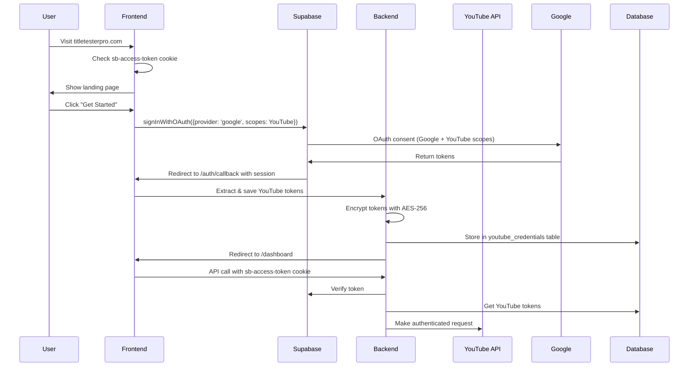

# TitleTesterPro Production Architecture
Version 2.0 - July 12, 2025

## Executive Summary

This architecture resolves all previous failures by committing to a single, coherent authentication pattern using Supabase's managed services. YouTube tokens are persisted securely, environment configuration is explicit, and the entire flow is testable and production-ready.

## 1. Authentication & Session Flow

### Architecture Decision: Supabase Cookie-Based Authentication



### Key Decisions:
- **No Authorization Headers**: Use httpOnly cookies exclusively
- **No Server Sessions**: Supabase handles all session management
- **Token Persistence**: YouTube tokens saved immediately after OAuth
- **Single Auth Flow**: No incremental consent, request all scopes upfront

## 2. Database Schema & Security

### Clean Schema Design

```sql
-- Users table (managed by Supabase Auth)
-- No custom user table needed

-- YouTube credentials (encrypted)
CREATE TABLE youtube_credentials (
  id UUID PRIMARY KEY DEFAULT gen_random_uuid(),
  user_id UUID NOT NULL REFERENCES auth.users(id) ON DELETE CASCADE,
  encrypted_access_token TEXT NOT NULL,
  encrypted_refresh_token TEXT NOT NULL,
  token_expires_at TIMESTAMPTZ NOT NULL,
  channel_id TEXT NOT NULL,
  channel_title TEXT NOT NULL,
  channel_thumbnail TEXT,
  created_at TIMESTAMPTZ DEFAULT NOW(),
  updated_at TIMESTAMPTZ DEFAULT NOW(),
  UNIQUE(user_id) -- One YouTube channel per user
);

-- Tests table
CREATE TABLE tests (
  id UUID PRIMARY KEY DEFAULT gen_random_uuid(),
  user_id UUID NOT NULL REFERENCES auth.users(id) ON DELETE CASCADE,
  video_id TEXT NOT NULL,
  video_title TEXT NOT NULL,
  video_thumbnail TEXT,
  status TEXT NOT NULL CHECK (status IN ('active', 'paused', 'completed', 'cancelled')),
  rotation_interval INTEGER NOT NULL CHECK (rotation_interval >= 60), -- minutes
  success_metric TEXT NOT NULL CHECK (success_metric IN ('ctr', 'views', 'combined')),
  winner_determination TEXT CHECK (winner_determination IN ('highest_ctr', 'highest_views', 'combined')),
  start_date TIMESTAMPTZ DEFAULT NOW(),
  end_date TIMESTAMPTZ,
  current_title_id UUID,
  created_at TIMESTAMPTZ DEFAULT NOW(),
  updated_at TIMESTAMPTZ DEFAULT NOW()
);

-- Title variants
CREATE TABLE titles (
  id UUID PRIMARY KEY DEFAULT gen_random_uuid(),
  test_id UUID NOT NULL REFERENCES tests(id) ON DELETE CASCADE,
  title_text TEXT NOT NULL,
  order_index INTEGER NOT NULL,
  is_original BOOLEAN DEFAULT FALSE,
  created_at TIMESTAMPTZ DEFAULT NOW(),
  UNIQUE(test_id, order_index)
);

-- Analytics data
CREATE TABLE title_analytics (
  id UUID PRIMARY KEY DEFAULT gen_random_uuid(),
  title_id UUID NOT NULL REFERENCES titles(id) ON DELETE CASCADE,
  views INTEGER DEFAULT 0,
  impressions INTEGER DEFAULT 0,
  clicks INTEGER DEFAULT 0,
  ctr DECIMAL(5,2) DEFAULT 0,
  avg_view_duration INTEGER DEFAULT 0, -- seconds
  collected_at TIMESTAMPTZ DEFAULT NOW(),
  UNIQUE(title_id, collected_at)
);

-- Rotation logs
CREATE TABLE rotation_logs (
  id UUID PRIMARY KEY DEFAULT gen_random_uuid(),
  test_id UUID NOT NULL REFERENCES tests(id) ON DELETE CASCADE,
  from_title_id UUID REFERENCES titles(id),
  to_title_id UUID NOT NULL REFERENCES titles(id),
  rotated_at TIMESTAMPTZ DEFAULT NOW(),
  youtube_api_response JSONB
);

-- Create indexes for performance
CREATE INDEX idx_tests_user_id ON tests(user_id);
CREATE INDEX idx_tests_status ON tests(status);
CREATE INDEX idx_titles_test_id ON titles(test_id);
CREATE INDEX idx_analytics_title_id ON title_analytics(title_id);
CREATE INDEX idx_analytics_collected_at ON title_analytics(collected_at);
CREATE INDEX idx_rotation_logs_test_id ON rotation_logs(test_id);
```

### Row Level Security (RLS)

```sql
-- Enable RLS on all tables
ALTER TABLE youtube_credentials ENABLE ROW LEVEL SECURITY;
ALTER TABLE tests ENABLE ROW LEVEL SECURITY;
ALTER TABLE titles ENABLE ROW LEVEL SECURITY;
ALTER TABLE title_analytics ENABLE ROW LEVEL SECURITY;
ALTER TABLE rotation_logs ENABLE ROW LEVEL SECURITY;

-- YouTube credentials policies
CREATE POLICY "Users can only see their own YouTube credentials"
  ON youtube_credentials FOR ALL
  USING (auth.uid() = user_id);

-- Tests policies
CREATE POLICY "Users can only see their own tests"
  ON tests FOR ALL
  USING (auth.uid() = user_id);

-- Titles policies (through test ownership)
CREATE POLICY "Users can see titles for their tests"
  ON titles FOR ALL
  USING (
    EXISTS (
      SELECT 1 FROM tests 
      WHERE tests.id = titles.test_id 
      AND tests.user_id = auth.uid()
    )
  );

-- Analytics policies (through test ownership)
CREATE POLICY "Users can see analytics for their tests"
  ON title_analytics FOR ALL
  USING (
    EXISTS (
      SELECT 1 FROM titles
      JOIN tests ON tests.id = titles.test_id
      WHERE titles.id = title_analytics.title_id
      AND tests.user_id = auth.uid()
    )
  );

-- Rotation logs policies
CREATE POLICY "Users can see rotation logs for their tests"
  ON rotation_logs FOR ALL
  USING (
    EXISTS (
      SELECT 1 FROM tests
      WHERE tests.id = rotation_logs.test_id
      AND tests.user_id = auth.uid()
    )
  );
```

## 3. Environment & Secrets Strategy

### Fixing Replit Override Issues

**Problem**: Replit Secrets override .env file silently
**Solution**: Explicit secret management strategy

1. **Check Replit Secrets Panel**:
   ```bash
   # In Replit Shell, list all environment variables
   env | grep -E "(DATABASE_URL|SUPABASE|PGHOST)"
   ```

2. **Remove Conflicting Secrets**:
   - Go to Replit Secrets panel
   - Delete any DATABASE_URL pointing to Neon
   - Delete any PG* variables
   - Keep only application-specific secrets

3. **Environment Variables Structure**:
   ```env
   # Supabase (Primary Database & Auth)
   SUPABASE_URL=https://xyehwoacgpsxakhjwglq.supabase.co
   SUPABASE_ANON_KEY=eyJhbG...
   SUPABASE_SERVICE_ROLE_KEY=eyJhbG...
   
   # Frontend needs VITE_ prefix
   VITE_SUPABASE_URL=https://xyehwoacgpsxakhjwglq.supabase.co
   VITE_SUPABASE_ANON_KEY=eyJhbG...
   
   # Application secrets
   ENCRYPTION_KEY=<32-byte-hex-string>
   
   # External services
   STRIPE_SECRET_KEY=sk_live_...
   ANTHROPIC_API_KEY=sk-ant-...
   
   # Production URL
   CLIENT_URL=https://titletesterpro.com
   ```

4. **Secret Generation**:
   ```bash
   # Generate secure encryption key
   openssl rand -hex 32
   ```

## 4. Deployment & Domain Configuration

### Domain Setup

1. **DNS Configuration**:
   ```
   A Record: titletesterpro.com → Replit IP
   CNAME: www.titletesterpro.com → titletesterpro.com
   ```

2. **SSL Certificate**:
   - Primary domain: titletesterpro.com (handled by Replit)
   - www redirect at DNS level (not application)

3. **Application-Level Redirect** (backup):
   ```typescript
   // Already implemented in server/index.ts
   app.use((req, res, next) => {
     if (req.hostname.startsWith('www.')) {
       return res.redirect(301, `https://titletesterpro.com${req.url}`);
     }
     next();
   });
   ```

## 5. UX/Business Logic Flow

### Complete User Journey

1. **Landing Page** (/)
   - Check for sb-access-token cookie
   - If authenticated, show "Go to Dashboard"
   - If not, show "Get Started"

2. **Login Flow** (/login)
   - Single "Sign in with Google" button
   - Request all scopes upfront:
     - openid, email, profile (Google identity)
     - youtube.readonly (read channel/videos)
     - youtube (update video titles)
     - yt-analytics.readonly (view analytics)

3. **OAuth Callback** (/auth/callback)
   - Supabase sets sb-access-token cookie
   - Extract YouTube tokens from Supabase session
   - Save encrypted tokens to youtube_credentials table
   - Redirect to dashboard

4. **Dashboard** (/dashboard)
   - Verify authentication via cookie
   - Fetch user's tests from database
   - Show active tests with current performance
   - "Create New Test" button

5. **Create Test Flow**
   - Select video from YouTube channel
   - Add 2-5 title variants
   - Set rotation interval (minimum 1 hour)
   - Choose success metric
   - Set end date (optional)
   - Submit → Creates test → Starts scheduler

6. **Test Management**
   - View real-time analytics
   - Pause/resume tests
   - See rotation history
   - Export results as CSV
   - Cancel test (deletes from database)

## 6. Error Handling & Monitoring

### Comprehensive Error Strategy

1. **Authentication Errors**:
   ```typescript
   // Middleware checks cookie and handles errors
   if (!token) {
     return res.status(401).json({ 
       error: 'Not authenticated',
       action: 'redirect_to_login' 
     });
   }
   
   // Token verification failure
   if (!user) {
     return res.status(401).json({ 
       error: 'Invalid session',
       action: 'clear_cookies_and_login' 
     });
   }
   ```

2. **YouTube API Errors**:
   ```typescript
   // Token expired
   if (error.status === 401) {
     const refreshed = await refreshYouTubeToken(userId);
     if (!refreshed) {
       return { error: 'youtube_reconnect_required' };
     }
     // Retry request
   }
   
   // Quota exceeded
   if (error.status === 429) {
     await pauseTest(testId);
     await notifyUser(userId, 'quota_exceeded');
   }
   ```

3. **Database Errors**:
   ```typescript
   // Connection pool exhausted
   pool.on('error', (err) => {
     console.error('Database pool error:', err);
     // Implement circuit breaker
   });
   
   // Transaction rollback on rotation failure
   try {
     await db.transaction(async (tx) => {
       await updateTitle(tx, ...);
       await logRotation(tx, ...);
     });
   } catch (error) {
     await notifyAdmin('rotation_failed', { testId, error });
   }
   ```

4. **User-Facing Error Messages**:
   ```typescript
   const errorMessages = {
     youtube_reconnect_required: "Please reconnect your YouTube account",
     quota_exceeded: "Daily YouTube API limit reached. Tests paused until tomorrow.",
     video_not_found: "This video no longer exists on YouTube",
     insufficient_permissions: "Please grant YouTube permissions to continue"
   };
   ```

## 7. Scalability & Quota Management

### YouTube API Quota Strategy

1. **Quota Allocation** (10,000 units/day):
   - List videos: 1 unit
   - Update title: 50 units
   - Get analytics: 1 unit
   - **Max capacity**: ~180 title updates/day

2. **Optimization Techniques**:
   ```typescript
   // Batch analytics requests
   const batchAnalytics = async (videoIds: string[]) => {
     return youtube.reports.query({
       ids: `channel==${channelId}`,
       metrics: 'views,estimatedMinutesWatched',
       dimensions: 'video',
       filters: `video==${videoIds.join(',')}`,
     });
   };
   
   // Cache video metadata (1 hour)
   const getVideoWithCache = async (videoId: string) => {
     const cached = await redis.get(`video:${videoId}`);
     if (cached) return JSON.parse(cached);
     
     const video = await youtube.videos.list({ id: videoId });
     await redis.setex(`video:${videoId}`, 3600, JSON.stringify(video));
     return video;
   };
   ```

3. **Rate Limiting**:
   ```typescript
   // Per-user limits
   const userLimits = {
     maxActiveTests: 10,
     maxTitlesPerTest: 5,
     minRotationInterval: 60, // minutes
     apiCallsPerHour: 100
   };
   
   // Global limits
   const globalLimits = {
     maxConcurrentRotations: 50,
     analyticsPollingInterval: 300, // 5 minutes
     quotaWarningThreshold: 8000 // 80% of daily quota
   };
   ```

### Database Scalability

1. **Connection Pooling**:
   ```typescript
   const pool = new Pool({
     connectionString: process.env.DATABASE_URL,
     max: 20, // connections
     idleTimeoutMillis: 30000,
     connectionTimeoutMillis: 2000,
   });
   ```

2. **Query Optimization**:
   ```sql
   -- Efficient test fetching with latest analytics
   WITH latest_analytics AS (
     SELECT DISTINCT ON (title_id) *
     FROM title_analytics
     ORDER BY title_id, collected_at DESC
   )
   SELECT t.*, array_agg(
     jsonb_build_object(
       'id', ti.id,
       'title', ti.title_text,
       'analytics', la.*
     ) ORDER BY ti.order_index
   ) as titles
   FROM tests t
   JOIN titles ti ON ti.test_id = t.id
   LEFT JOIN latest_analytics la ON la.title_id = ti.id
   WHERE t.user_id = $1 AND t.status = 'active'
   GROUP BY t.id;
   ```

## 8. How This Fixes Previous Problems

### Authentication Confusion → Single Pattern
- **Before**: Mixed sessions, bearer tokens, and Supabase
- **Now**: Only Supabase cookies (sb-access-token)
- **Fix**: Removed all Authorization header logic, express-session, and custom auth

### Database Configuration → Explicit Management
- **Before**: Hidden Replit secrets overriding .env
- **Now**: Clear instructions to check and remove Replit DATABASE_URL
- **Fix**: Document secret precedence, provide verification commands

### YouTube Token Persistence → Immediate Save
- **Before**: Tokens received but never saved
- **Now**: Extract and encrypt tokens in auth callback
- **Fix**: Created youtube_credentials table with encryption

### Incomplete Migrations → Clean Schema
- **Before**: OAuth fields scattered across tables
- **Now**: Single youtube_credentials table
- **Fix**: Clear foreign keys, indexes, and RLS policies

### No Error Handling → Comprehensive Strategy
- **Before**: Silent failures, no user feedback
- **Now**: Specific error codes and user actions
- **Fix**: Handle token refresh, quota limits, connection errors

## 9. Implementation Checklist

1. **Environment Setup**:
   - [ ] Remove DATABASE_URL from Replit Secrets
   - [ ] Verify Supabase connection works
   - [ ] Generate secure encryption key

2. **Database Migration**:
   - [ ] Drop old tables (accounts, sessions)
   - [ ] Create new schema with RLS
   - [ ] Run test queries to verify

3. **Code Changes**:
   - [ ] Update auth middleware for cookies only
   - [ ] Implement YouTube token persistence
   - [ ] Remove Authorization header logic
   - [ ] Add error handling throughout

4. **Testing**:
   - [ ] Complete login flow
   - [ ] Create test with multiple titles
   - [ ] Verify rotation works
   - [ ] Check analytics collection

5. **Deployment**:
   - [ ] Update production CLIENT_URL
   - [ ] Configure domain DNS
   - [ ] Monitor error logs
   - [ ] Verify quota usage

## Conclusion

This architecture provides a coherent, testable, and scalable solution by:
1. Using Supabase as designed (cookies, not sessions)
2. Persisting YouTube tokens immediately after OAuth
3. Providing clear environment configuration
4. Implementing comprehensive error handling
5. Planning for scale with quota management

The system is now ready for MVP launch with a clear path to handle growth.